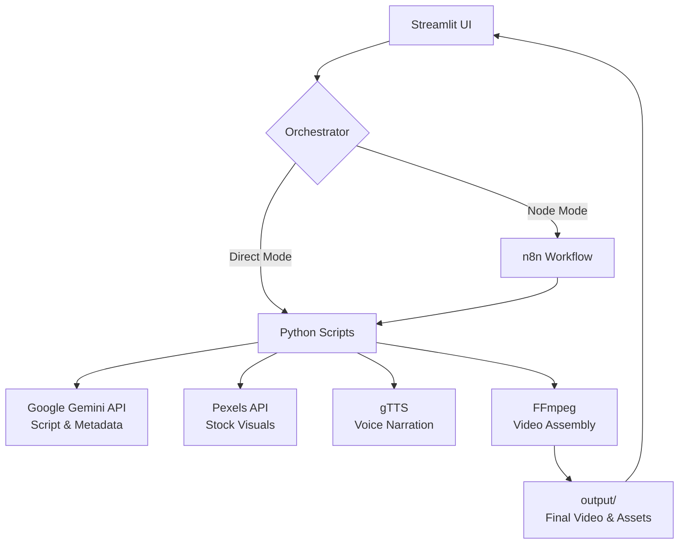

<div align="center">
  <h1>🎬 AI YouTube Automation Platform</h1>
  <p>An end-to-end, fully automated pipeline that generates YouTube videos — from topic selection and scriptwriting to voiceover, stock footage, and final video assembly.</p>

  
  
  
  
  
</div>

---

## ✨ Features

- **🧠 AI Scriptwriter**: Generates engaging, structured scripts (educational, entertaining, or motivational) using Google Gemini.
- **🎙️ Voice Narration**: Converts script scenes into natural-sounding speech using `gTTS`.
- **📸 Dynamic Visuals**: Automatically searches and fetches relevant high-quality stock footage/images via the Pexels API.
- **🎥 Automated Assembly**: Stitches audio and visuals together smoothly using FFmpeg.
- **📈 Metadata Generator**: Uses AI to create optimized YouTube titles, descriptions, and tags.
- **🖥️ Streamlit UI**: A clean, interactive dashboard to run the pipeline, preview videos, and manage outputs.
- **🔄 n8n Integration (Optional)**: Provides a ready-to-use `workflow.json` to orchestrate the pipeline as a scalable node-based workflow.

---

## 🏗️ Architecture



---

## 🚀 Quick Start

### 1. Prerequisites
- **Python 3.10+**
- **FFmpeg**: Must be installed and accessible on your system `PATH`.
- API Keys for **Google Gemini** and **Pexels**.

### 2. Clone & Install
```bash
git clone https://github.com/MItrax-Soni/Youtube-AI-Video-Automation.git
cd Youtube-AI-Video-Automation
pip install -r requirements.txt
```

### 3. Configure API Keys
Copy the example environment file and add your actual API credentials:
```bash
cp .env.example .env
```
Open `.env` and fill in:
```env
GEMINI_API_KEY=your_gemini_api_key
PEXELS_API_KEY=your_pexels_api_key
```

### 4. Run the App
Launch the Streamlit dashboard:
```bash
streamlit run app.py
```

*(Optional) Start n8n for node-based workflows:*
```bash
npx n8n
```
*Then import `n8n/workflow.json` into your n8n editor.*

---

## 📂 Project Structure

```text
youtube-automation/
├── app.py                      # 🖥️ Streamlit dashboard entry point
├── n8n/
│   └── workflow.json           # 🔄 n8n workflow configuration
├── scripts/
│   ├── config.py               # ⚙️ Centralized configuration
│   ├── trend.py                # 📈 Trending topic discovery
│   ├── script_generator.py     # ✍️ AI script writing (Gemini)
│   ├── voice_generator.py      # 🗣️ Text-to-speech (gTTS)
│   ├── visual_generator.py     # 🖼️ Image/video collection (Pexels)
│   ├── video_generator.py      # 🎞️ Video assembly (FFmpeg)
│   ├── metadata_generator.py   # 🏷️ Title/description/tags (Gemini)
│   ├── upload.py               # ☁️ YouTube upload script
│   └── pipeline.py             # ⚙️ End-to-end Python orchestrator
├── assets/                     # 📁 Intermediate files (audio, images)
├── output/                     # 🎬 Final generated videos
├── requirements.txt            # 📦 Python dependencies
├── .env.example                # 🔑 Environment variable template
└── README.md                   # 📖 Project documentation
```

---

## 🎓 About

This is a college/university final-year engineering project built to demonstrate end-to-end media automation using Large Language Models, third-party APIs, and programmatic video rendering.
