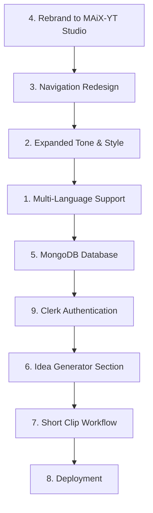

# MAiX-YT Studio — Major Feature Upgrade Plan

Comprehensive plan for 9 feature improvements to evolve the project from a local prototype into a deployable, authenticated, multi-language video platform.

---

## User Review Required

> [!IMPORTANT]
> **MongoDB Atlas**: You'll need to create a free MongoDB Atlas cluster and provide the connection string. I'll add it to `.env` as `MONGODB_URI`.

> [!IMPORTANT]
> **Clerk Authentication**: You already have Clerk keys in `.env`. I'll integrate Clerk with the Streamlit app using `streamlit-clerk` or a custom JWT-based auth gate. Clerk's native SDK is React-based, so for Streamlit we'll use their Backend API to verify sessions.

> [!WARNING]
> **Vercel Deployment (Item 8)**: Streamlit apps **cannot be deployed to Vercel** natively — Vercel is for Node.js/Next.js/static sites. Your options are:
> - **Streamlit Community Cloud** (free, easiest — just connect your GitHub repo)
> - **Railway** or **Render** (free tier, supports Python apps)
> - **Convert to Next.js** (major rewrite — not recommended right now)
>
> I recommend **Streamlit Community Cloud** as the deployment target. Please confirm.

## Open Questions

> [!IMPORTANT]
> 1. **Google Flow AI (Item 7)**: Could you clarify what "Google Flow AI" refers to? Do you mean **Google Veo** (video generation), **Imagen** (image generation), or a specific Google Cloud service? This determines how the short-clip workflow will be built.
>
> 2. **Languages**: For Hindi and Gujarati, Edge-TTS supports `hi-IN-SwaraNeural` (Hindi Female), `hi-IN-MadhurNeural` (Hindi Male), and `gu-IN-DhwaniNeural` (Gujarati Female), `gu-IN-NiranjanNeural` (Gujarati Male). The script will also be generated in the selected language via Gemini. Should the **UI text** also change to that language, or just the video content?
>
> 3. **Short Clips (Item 7)**: When you say "8-10 sec short clip with background music, voice over and animation" — should this be a completely separate generation mode (like a "Shorts Generator" page), or added as an option within the existing Generate Video page?

---

## Proposed Changes

### Feature 1: Multi-Language Support (Hindi, Gujarati, English)

#### [MODIFY] [voice_generator.py](file:///d:/Projects/YT/scripts/voice_generator.py)
- Expand `EDGE_TTS_VOICES` from a flat `{male, female}` dict to a nested `{language: {male, female}}` dict:
  ```python
  EDGE_TTS_VOICES = {
      "english": {"male": "en-US-GuyNeural", "female": "en-US-JennyNeural"},
      "hindi":   {"male": "hi-IN-MadhurNeural", "female": "hi-IN-SwaraNeural"},
      "gujarati":{"male": "gu-IN-NiranjanNeural", "female": "gu-IN-DhwaniNeural"},
  }
  ```
- Add `language` parameter to `generate_voice()` signature
- Update gTTS calls to use `lang="hi"` / `lang="gu"` accordingly

#### [MODIFY] [script_generator.py](file:///d:/Projects/YT/scripts/script_generator.py)
- Add `language` parameter to `generate_script()`
- Update `SCRIPT_PROMPT` to include: `"Language: {language}. Write the ENTIRE narration in {language}."`
- Update mock templates with language-aware fallback narrations

#### [MODIFY] [pipeline.py](file:///d:/Projects/YT/scripts/pipeline.py)
- Pass `language` through the entire pipeline from `run_pipeline()` → `generate_script()` → `generate_voice()`

#### [MODIFY] [app.py](file:///d:/Projects/YT/app.py)
- Add **Language** selectbox in Generate Video page: `["English", "Hindi (हिन्दी)", "Gujarati (ગુજરાતી)"]`
- Add language selector in Quick Generate section on Dashboard
- Pass language through `_run_direct_with_progress()`

---

### Feature 2: Expanded Tone & Style Options (per your reference image)

#### [MODIFY] [app.py](file:///d:/Projects/YT/app.py)
- **Tone options** (currently 3) → expand to 8:
  ```
  Neutral, Friendly, Serious, Conversational, Energetic, Inspirational, Dramatic, Authoritative
  ```
- **Style options** (currently 4) → expand to 8:
  ```
  Documentary, Educational Explainer, Storytelling, News, Cinematic, Entertainment, Listicle, Case Study
  ```
- Update both Generate Video page and Dashboard Quick Generate dropdowns

#### [MODIFY] [config.py](file:///d:/Projects/YT/scripts/config.py)
- Add `STYLE_EFFECT_PROFILES` entries for new styles:
  - **Storytelling**: slow dissolves, gentle zoom, warm transitions
  - **News**: fast cuts, minimal zoom, clean transitions
  - **Cinematic**: dramatic zooms, long dissolves, letterbox-style
  - **Listicle**: numbered segments, quick fades, numbered overlays
  - **Case Study**: split-screen feel, methodical pacing

#### [MODIFY] [script_generator.py](file:///d:/Projects/YT/scripts/script_generator.py)
- The `SCRIPT_PROMPT` already receives `{tone}` and passes it to Gemini, so the new tones (Neutral, Friendly, Serious, etc.) will work automatically — Gemini adapts its writing style based on the tone word. No structural change needed, just the expanded list in the UI.

---

### Feature 2.5: Tone and Style Validation
- The user noted that Tone and Style changes don't seem to have a noticeable effect on the final output.
- **Tone Validation**: I will review `script_generator.py` to ensure the `tone` variable is strongly emphasized in the `SCRIPT_PROMPT` so Gemini dramatically changes the script's personality and word choice.
- **Style Validation**: I will review `video_generator.py` and `visual_generator.py` to ensure the `style` parameter actively dictates visual generation (e.g. image prompts, transitions, and pacing) rather than being ignored or overridden by defaults.

---

### Feature 2.6: Aspect Ratio Selection (9:16 / 16:9)
- **UI Update**: Add an Aspect Ratio selector (16:9 Landscape, 9:16 Portrait) in `app.py`.
- **Backend Plumbing**: Pass `aspect_ratio` through `pipeline.py`, `visual_generator.py` and `video_generator.py`.
- **Visual Generator Update**: Ensure the image queries request vertical images (e.g., cropping horizontal images for 9:16 or specifying `orientation=portrait` to Pexels).
- **Video Generator Update**: Ensure `ffmpeg` resizes the final output to 1080x1920 (for 9:16) or 1920x1080 (for 16:9) appropriately, handling padding or cropping.

---

### Feature 3: Navigation Bar Redesign

#### [MODIFY] [app.py](file:///d:/Projects/YT/app.py) — CSS section
- Redesign sidebar navigation from plain radio buttons to a premium nav with:
  - **Animated logo/brand** area with gradient text and subtle glow animation
  - **Glass-card nav items** with hover glow effects, active item highlight bar (left border accent)
  - **Icon badges** with subtle pulse on active page
  - **Collapsible sections** (e.g., "Generation" group containing Generate Video + History + Idea Generator)
  - **Bottom toolbar** with user avatar placeholder and system status
- Add CSS animations: slide-in on page change, shimmer on hover, active item gradient border

---

### Feature 4: Rebrand to "MAiX-YT Studio"

#### [MODIFY] [app.py](file:///d:/Projects/YT/app.py)
- Change `page_title` in `st.set_page_config()` from `"AI YouTube Studio"` to `"MAiX-YT Studio"`
- Update sidebar brand HTML: `<h2>MAiX-YT Studio</h2>`
- Update Dashboard hero: `"MAiX-YT Studio — Command Center"`
- Update About page references
- Update version caption: `"v3.0 — MAiX-YT Studio"`

#### [MODIFY] [.env](file:///d:/Projects/YT/.env)
- Update comment header

#### [MODIFY] [README.md](file:///d:/Projects/YT/README.md)
- Update project name and references

---

### Feature 5: MongoDB Atlas Cloud Database

Currently, data is stored as JSON files in `output/video_*/metadata.json`. This needs to migrate to MongoDB for cloud persistence.

#### [NEW] [scripts/database.py](file:///d:/Projects/YT/scripts/database.py)
- MongoDB connection manager using `pymongo`
- Collections:
  - `generations` — stores all video generation metadata (replaces `metadata.json` scanning)
  - `users` — stores user profiles (linked to Clerk user IDs from Feature 9)
  - `ideas` — stores saved ideas (for Feature 6)
- Functions:
  - `save_generation(user_id, metadata)` — insert generation record
  - `get_user_generations(user_id)` — fetch user's generation history
  - `delete_generation(gen_id)` — remove a generation
  - `save_idea(user_id, idea)` / `get_user_ideas(user_id)` — idea CRUD

#### [MODIFY] [pipeline.py](file:///d:/Projects/YT/scripts/pipeline.py)
- After pipeline completes, also call `save_generation()` to persist to MongoDB

#### [MODIFY] [app.py](file:///d:/Projects/YT/app.py)
- `_load_history()` — add MongoDB as primary source, fall back to local JSON scanning
- Generation History page — load from MongoDB

#### [MODIFY] [.env](file:///d:/Projects/YT/.env)
- Add `MONGODB_URI=mongodb+srv://<user>:<pass>@cluster.mongodb.net/maix_yt`

#### [MODIFY] [requirements.txt](file:///d:/Projects/YT/requirements.txt)
- Add `pymongo[srv]`

---

### Feature 6: Dedicated Idea Generation Section

#### [MODIFY] [app.py](file:///d:/Projects/YT/app.py)
- **New page**: `page_idea_generator()` — a dedicated "Idea Lab" page
  - AI-powered brainstorming using Gemini: user enters a niche/keyword → generates 10+ video ideas with titles, descriptions, estimated engagement scores
  - "Save Idea" button → stores to MongoDB `ideas` collection
  - "Use Idea" button → navigates to Generate Video page with the idea pre-filled as the topic (sets `st.session_state["selected_topic"]` and switches page)
  - Saved ideas grid with delete/edit
- Add `"💡 Idea Generator"` to sidebar navigation (between Generate Video and Generation History)
- Trending topics integration (reuse existing `discover_trends()`)

---

### Feature 7: n8n Short-Clip Workflow

> [!NOTE]
> Pending your clarification on "Google Flow AI". The plan below assumes we integrate with a video/image generation API.

#### [NEW] [n8n/short_clip_workflow.json](file:///d:/Projects/YT/n8n/short_clip_workflow.json)
- New n8n workflow for generating 8-10 second short clips:
  1. **Webhook Trigger** — receives topic, mood, music style
  2. **Script Node** — Gemini generates a 2-3 sentence script (20-25 words)
  3. **Voice Node** — TTS narration
  4. **Visual Sequence Node** — generates 3-4 quick visuals (each 2-3 seconds)
  5. **Animation Node** — applies zoom/pan/transition effects
  6. **Background Music Node** — selects/applies music track
  7. **Compile Node** — FFmpeg stitches visuals + voice + music into final clip
  8. **Response Node** — returns the generated clip

#### [MODIFY] [app.py](file:///d:/Projects/YT/app.py)
- Add "Short Clip Generator" section within the n8n Workflow page
- UI: Topic input, mood selector, music style, "Generate Short Clip" button
- Triggers the new n8n workflow webhook

#### [NEW] [scripts/short_clip_generator.py](file:///d:/Projects/YT/scripts/short_clip_generator.py)
- Standalone Python module for short clip generation (for direct execution mode)
- Simplified pipeline: micro-script → voice → 3-4 rapid visuals → compile with music

---

### Feature 8: Deployment Preparation

> Awaiting your confirmation on deployment platform (see Warning above).

#### Changes for Streamlit Community Cloud:
- [MODIFY] [requirements.txt](file:///d:/Projects/YT/requirements.txt) — ensure all dependencies listed
- [NEW] [.streamlit/config.toml](file:///d:/Projects/YT/.streamlit/config.toml) — Streamlit server config
- [NEW] [.streamlit/secrets.toml](file:///d:/Projects/YT/.streamlit/secrets.toml) — secrets template (actual secrets set in Streamlit Cloud dashboard)
- Ensure all file paths use `Path` objects (not hardcoded Windows paths)
- Ensure `.env` vars are read from `st.secrets` when `secrets.toml` is available (Streamlit Cloud) with `.env` fallback for local development

---

### Feature 9: Clerk Authentication

#### [MODIFY] [app.py](file:///d:/Projects/YT/app.py)
- Add authentication gate at the very top of `main()`:
  - On first visit: show a login/signup page using Clerk's hosted sign-in URL
  - Verify session using Clerk Backend API (`/v1/sessions/verify` or JWT verification)
  - Store authenticated `user_id` in `st.session_state`
  - All subsequent DB operations use this `user_id` to scope data
- Add "Sign Out" button in sidebar (bottom)
- Protect all pages behind auth check

#### [NEW] [scripts/auth.py](file:///d:/Projects/YT/scripts/auth.py)
- `verify_clerk_session(session_token)` — verify JWT using Clerk's public JWKS endpoint
- `get_clerk_user(user_id)` — fetch user profile from Clerk Backend API
- `create_login_url()` / `create_signup_url()` — generate Clerk hosted auth URLs

#### [MODIFY] [.env](file:///d:/Projects/YT/.env)
- Already has Clerk keys ✅

#### [MODIFY] [requirements.txt](file:///d:/Projects/YT/requirements.txt)
- Add `pyjwt[crypto]`, `cryptography`

---

## Implementation Order

The features have dependencies, so the recommended execution order is:



| Phase | Features | Estimated Scope |
|-------|----------|----------------|
| **Phase 1** | 4 (Rebrand) + 3 (Nav) + 2 (Tone/Style) | UI/CSS changes, no backend |
| **Phase 2** | 1 (Language) | Backend + UI, pipeline changes |
| **Phase 3** | 5 (MongoDB) + 9 (Clerk Auth) | Infrastructure, new modules |
| **Phase 4** | 6 (Idea Generator) | New page, DB integration |
| **Phase 5** | 7 (Short Clips) | New workflow, new module |
| **Phase 6** | 8 (Deploy) | Config + testing |

---

## Verification Plan

### Automated Tests
```bash
# Test language voice generation
python -m scripts.voice_generator --script-file assets/script.json --gender female --engine "Edge-TTS (Neural)" --language hindi

# Test pipeline with new parameters
python -m scripts.pipeline --topic "AI in Healthcare" --tone "Dramatic" --style "Cinematic" --duration 60

# Test MongoDB connection
python -c "from scripts.database import get_db; print(get_db().list_collection_names())"

# Test Clerk auth
python -c "from scripts.auth import verify_clerk_session; print('Auth module OK')"
```

### Manual Verification
- Run the Streamlit app and test each page
- Verify login/signup flow works with Clerk
- Generate a video in Hindi and confirm voice is in Hindi
- Verify generation history loads from MongoDB
- Test the Idea Generator page end-to-end
- Verify the rebrand appears everywhere (title bar, sidebar, about page)
