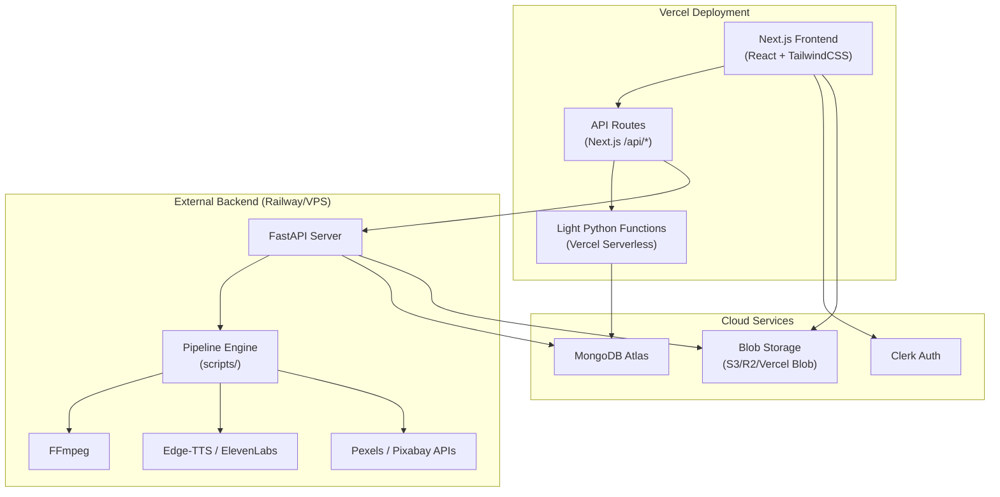

# Deploy MAiX-YT Studio on Vercel (Streamlit → Next.js + FastAPI Migration)

## Problem & Background

The current app is a **monolithic Streamlit Python application** ([app.py](file:///d:/Projects/YT/app.py) — 2318 lines) with a Python backend pipeline. Streamlit cannot be deployed to Vercel because Vercel natively supports **Node.js/Next.js frontends** and **Python serverless functions** — not long-running Python web servers like Streamlit.

This migration requires splitting the app into:
1. **Next.js Frontend** — Recreates the entire Streamlit UI as a modern React/Next.js web app
2. **Python Serverless API** — Wraps the existing `scripts/` pipeline as Vercel Python serverless functions

---

## User Review Required

> [!IMPORTANT]
> **This is a major architectural rewrite.** The entire Streamlit UI (93KB, 8 pages, ~2300 lines) must be rebuilt in React/Next.js. The Python backend logic (`scripts/`) stays largely intact but must be adapted for serverless execution.

> [!WARNING]
> **Vercel Serverless Function Limits:**
> - **Execution timeout:** 10s on Hobby plan, 60s on Pro plan, 300s on Enterprise
> - **Payload size:** 4.5MB request, 4.5MB response
> - **Package size:** 250MB (zipped)
> - Your video generation pipeline (script → voice → visuals → FFmpeg assembly) can take **2–5+ minutes** and produces large video files. This **cannot run inside a single Vercel serverless function**.
>
> **Recommended approach:** Use Vercel for the **frontend + lightweight API endpoints** (script generation, metadata, API status, settings), but offload **heavy pipeline work** (voice, visuals, FFmpeg) to an external service like a **VPS, Railway, Render, or a dedicated backend server** that the Vercel frontend calls.

> [!CAUTION]
> **FFmpeg is not available** in Vercel serverless functions. The video assembly step requires FFmpeg, which cannot be installed in Vercel's serverless runtime. The pipeline must either:
> - Run on an external server (recommended)
> - Use a cloud FFmpeg service
> - Be triggered via your existing n8n webhook workflow

---

## Open Questions

> [!IMPORTANT]
> **1. Pipeline Execution Strategy — Where should the heavy video generation run?**
> - **Option A (Recommended):** Vercel frontend + API routes for light tasks. Heavy pipeline runs on a **separate backend server** (Railway, Render, VPS, or your local machine exposed via n8n). The Vercel app sends a POST to start generation and polls for status.
> - **Option B:** Vercel frontend only. Pipeline is **not accessible from the deployed app** — you run it locally and the web app is just a dashboard/viewer.
> - **Option C:** Move the entire backend to **Vercel + Vercel Blob Storage**, using Vercel's Python runtime for light API endpoints only (status checks, metadata, trend discovery), with pipeline execution triggered via n8n webhook.

> [!IMPORTANT]  
> **2. Authentication:** You currently use Clerk for auth. Clerk has **first-class Next.js support** (`@clerk/nextjs`), which would be a significant upgrade over the current JWT-paste workaround in Streamlit. Should we integrate Clerk's native Next.js middleware?

> [!IMPORTANT]
> **3. Storage:** Generated videos are currently saved to local filesystem (`output/` directory). On Vercel, the filesystem is **ephemeral** (no persistent storage). Options:
> - **Vercel Blob Storage** — For storing generated videos
> - **AWS S3 / Cloudflare R2** — For video file storage
> - **MongoDB Atlas** — Already configured, can store metadata (but not video files)

---

## Proposed Changes

### Architecture Overview



---

### Component 1: Project Structure Reorganization

Create a Next.js app alongside the existing Python backend:

```
YT/
├── frontend/                    # NEW — Next.js app (deploys to Vercel)
│   ├── app/                     # Next.js App Router
│   │   ├── layout.tsx           # Root layout with Clerk provider
│   │   ├── page.tsx             # Dashboard (home)
│   │   ├── generate/page.tsx    # Generate Video page
│   │   ├── history/page.tsx     # Generation History page
│   │   ├── ideas/page.tsx       # Idea Generator page
│   │   ├── workflow/page.tsx    # n8n Workflow page
│   │   ├── api-status/page.tsx  # API Status page
│   │   ├── settings/page.tsx    # Settings page
│   │   ├── about/page.tsx       # About page
│   │   ├── sign-in/page.tsx     # Clerk sign-in
│   │   └── api/                 # Next.js API routes
│   │       ├── generate/route.ts        # Trigger pipeline
│   │       ├── status/route.ts          # Check generation status
│   │       ├── trends/route.ts          # Get trending topics
│   │       ├── api-check/route.ts       # API connectivity check
│   │       ├── history/route.ts         # CRUD for generation history
│   │       └── settings/route.ts        # Read/write settings
│   ├── components/              # Reusable React components
│   │   ├── Sidebar.tsx          # Navigation sidebar
│   │   ├── GlassCard.tsx        # Glassmorphism card component
│   │   ├── StatsCard.tsx        # Metric display card
│   │   ├── ProgressTracker.tsx  # Pipeline progress UI
│   │   ├── VideoPlayer.tsx      # Video preview player
│   │   └── NeonBackground.tsx   # Animated background
│   ├── styles/
│   │   └── globals.css          # Premium dark theme (port from Streamlit CSS)
│   ├── lib/
│   │   ├── api.ts               # API client helpers
│   │   └── types.ts             # TypeScript interfaces
│   ├── middleware.ts             # Clerk auth middleware
│   ├── next.config.js
│   ├── package.json
│   ├── tsconfig.json
│   ├── vercel.json
│   └── .env.local               # Vercel env vars
│
├── backend/                     # NEW — FastAPI server (deploys to Railway/Render/VPS)
│   ├── main.py                  # FastAPI app entry point
│   ├── routes/
│   │   ├── generate.py          # /api/generate endpoint
│   │   ├── status.py            # /api/status endpoint
│   │   ├── trends.py            # /api/trends endpoint
│   │   └── api_check.py         # /api/api-check endpoint
│   ├── requirements.txt         # Backend-specific deps
│   └── Dockerfile               # For Railway/Render deployment
│
├── scripts/                     # EXISTING — Unchanged pipeline modules
│   ├── config.py                # Minor updates for cloud env detection
│   ├── pipeline.py
│   ├── script_generator.py
│   ├── voice_generator.py
│   ├── visual_generator.py
│   ├── video_generator.py
│   ├── metadata_generator.py
│   ├── database.py
│   ├── auth.py
│   ├── trend.py
│   └── upload.py
│
├── app.py                       # EXISTING — Keep for local dev (unchanged)
├── requirements.txt             # EXISTING
├── settings.json                # EXISTING
└── .env                         # EXISTING
```

---

### Component 2: Next.js Frontend

#### [NEW] `frontend/package.json`
- Dependencies: `next`, `react`, `react-dom`, `@clerk/nextjs`, `framer-motion`, `lucide-react`
- Dev deps: `typescript`, `@types/react`, `tailwindcss`, `postcss`, `autoprefixer`

#### [NEW] `frontend/app/layout.tsx`
- Root layout with Clerk `<ClerkProvider>`
- Google Fonts (Inter) import
- Global CSS import
- Dark theme `<html>` wrapper

#### [NEW] `frontend/app/page.tsx` (Dashboard)
- Port of `page_dashboard()` from [app.py:L1220+](file:///d:/Projects/YT/app.py)
- Stats cards (total generations, success rate, processing time)
- Quick actions grid
- Recent activity feed

#### [NEW] `frontend/app/generate/page.tsx`
- Port of `page_generate()` from [app.py](file:///d:/Projects/YT/app.py)
- Topic input, tone/duration/voice/style selectors
- Real-time progress tracker with WebSocket or polling
- Result display with video player and metadata

#### [NEW] `frontend/styles/globals.css`
- **Direct port** of the 1000+ line CSS from [app.py inject_css()](file:///d:/Projects/YT/app.py#L51-L1031)
- Neon grid background, glassmorphism cards, gradient effects
- All keyframe animations (orb-float, grid-scroll, streak-fall, etc.)
- Adapted from Streamlit-specific selectors to standard CSS classes

#### [NEW] `frontend/components/NeonBackground.tsx`
- Port of [inject_dynamic_background()](file:///d:/Projects/YT/app.py#L1034-L1072)
- React component with animated grid, floating orbs, and light streaks

#### [NEW] `frontend/components/Sidebar.tsx`
- Port of [render_sidebar()](file:///d:/Projects/YT/app.py#L1143-L1210)
- Logo with rotating border animation
- Navigation links with active state
- System status indicator

#### [NEW] `frontend/middleware.ts`
- Clerk authentication middleware
- Protect all routes except `/sign-in`

#### [NEW] `frontend/vercel.json`
```json
{
  "framework": "nextjs",
  "env": {
    "NEXT_PUBLIC_BACKEND_URL": "@backend_url"
  }
}
```

---

### Component 3: FastAPI Backend Server

#### [NEW] `backend/main.py`
- FastAPI application wrapping the existing `scripts/` modules
- CORS middleware for Vercel frontend origin
- Endpoints:
  - `POST /api/generate` — Start pipeline (returns job ID)
  - `GET /api/generate/{job_id}` — Poll job status
  - `POST /api/trends` — Get trending topics
  - `GET /api/api-check` — Check all API connectivity
  - `GET /api/history` — List past generations
  - `GET /api/settings` — Get settings
  - `PUT /api/settings` — Update settings
- Background task runner for pipeline execution (using `asyncio` or `BackgroundTasks`)

#### [NEW] `backend/Dockerfile`
```dockerfile
FROM python:3.11-slim
RUN apt-get update && apt-get install -y ffmpeg
COPY requirements.txt .
RUN pip install -r requirements.txt
COPY . .
CMD ["uvicorn", "main:app", "--host", "0.0.0.0", "--port", "8000"]
```

#### [NEW] `backend/requirements.txt`
- `fastapi`, `uvicorn`, `python-dotenv`
- Plus all existing deps from [requirements.txt](file:///d:/Projects/YT/requirements.txt) except `streamlit`

---

### Component 4: Existing Code Modifications

#### [MODIFY] [config.py](file:///d:/Projects/YT/scripts/config.py)
- Add `IS_VERCEL` environment detection (`os.getenv("VERCEL")`)
- Update `get_env_or_secret()` to remove Streamlit secrets fallback when running on Vercel
- Add `BACKEND_URL` config for frontend→backend communication

#### [MODIFY] [pipeline.py](file:///d:/Projects/YT/scripts/pipeline.py)
- Add a `job_id` return value for async tracking
- Add status file writing (`status.json` in project dir) for polling
- Remove Streamlit-specific `progress_callback` dependency

#### [MODIFY] [database.py](file:///d:/Projects/YT/scripts/database.py)
- No major changes — already cloud-ready with MongoDB Atlas

#### [MODIFY] [auth.py](file:///d:/Projects/YT/scripts/auth.py)  
- Keep for backend JWT verification
- Frontend auth will be handled natively by `@clerk/nextjs`

---

### Component 5: Vercel Deployment Configuration

#### [NEW] `frontend/.env.local`
```env
NEXT_PUBLIC_CLERK_PUBLISHABLE_KEY=pk_test_...
CLERK_SECRET_KEY=sk_test_...
NEXT_PUBLIC_BACKEND_URL=https://your-backend.railway.app
```

#### Vercel Dashboard Setup
- Connect the `frontend/` directory as the Vercel project root
- Set environment variables in Vercel dashboard:
  - `NEXT_PUBLIC_CLERK_PUBLISHABLE_KEY`
  - `CLERK_SECRET_KEY`  
  - `NEXT_PUBLIC_BACKEND_URL` (points to Railway/Render/VPS backend)

---

## Page-by-Page Migration Map

| Streamlit Page | Function in `app.py` | Next.js Route | Complexity |
|---|---|---|---|
| Dashboard | `page_dashboard()` | `/` (home) | Medium |
| Generate Video | `page_generate()` | `/generate` | **High** — progress tracking, form state |
| Idea Generator | `page_idea_generator()` | `/ideas` | Low |
| Generation History | `page_history()` | `/history` | Medium — video playback, downloads |
| n8n Workflow | `page_n8n()` | `/workflow` | Low |
| API Status | `page_api_status()` | `/api-status` | Medium — live status checks |
| Settings | `page_settings()` | `/settings` | Medium — form with persistence |
| About | `page_about()` | `/about` | Low — static content |
| Auth Gate | `main()` auth section | Clerk middleware | Low — native Clerk support |

---

## Verification Plan

### Automated Tests
```bash
# Frontend
cd frontend && npm run build   # Verify Next.js builds without errors
cd frontend && npm run lint     # Check for lint issues

# Backend
cd backend && python -m pytest  # Run backend tests
cd backend && uvicorn main:app  # Verify FastAPI starts
```

### Manual Verification
1. **Local dev:** Run `npm run dev` for frontend + `uvicorn` for backend simultaneously
2. **Vercel Preview:** Push to GitHub branch → Vercel auto-deploys preview
3. **API connectivity:** Test all `/api/*` routes return correct responses
4. **Auth flow:** Verify Clerk sign-in/sign-out works on deployed URL
5. **Pipeline trigger:** Start a video generation from the deployed frontend, verify it runs on the backend
6. **Video playback:** Verify generated videos are accessible from the frontend

---

## Estimated Effort

| Phase | Work | Estimate |
|---|---|---|
| 1. Project scaffolding | Next.js init, folder structure, configs | ~1 hour |
| 2. CSS/Design system port | Port 1000+ lines of premium CSS to globals.css | ~2 hours |
| 3. Shared components | Sidebar, GlassCard, NeonBackground, etc. | ~2 hours |
| 4. Page implementations | 8 pages with full interactivity | ~6–8 hours |
| 5. API routes | Next.js API routes + FastAPI backend | ~3 hours |
| 6. Clerk integration | Native Next.js auth | ~1 hour |
| 7. Backend Dockerization | Dockerfile, Railway/Render deploy config | ~1 hour |
| 8. Testing & polish | E2E testing, responsive design, bug fixes | ~2 hours |
| **Total** | | **~18–20 hours** |

---

## Summary

This is a **full-stack rewrite** of the frontend from Streamlit to Next.js, with the Python backend wrapped in FastAPI and deployed separately. The core pipeline code in `scripts/` remains largely untouched. The main work is:

1. **Rebuild the UI** in React/Next.js with the same premium dark theme
2. **Create API endpoints** that bridge the frontend to the Python pipeline
3. **Deploy frontend to Vercel**, backend to Railway/Render
4. **Integrate Clerk natively** for much better auth UX
